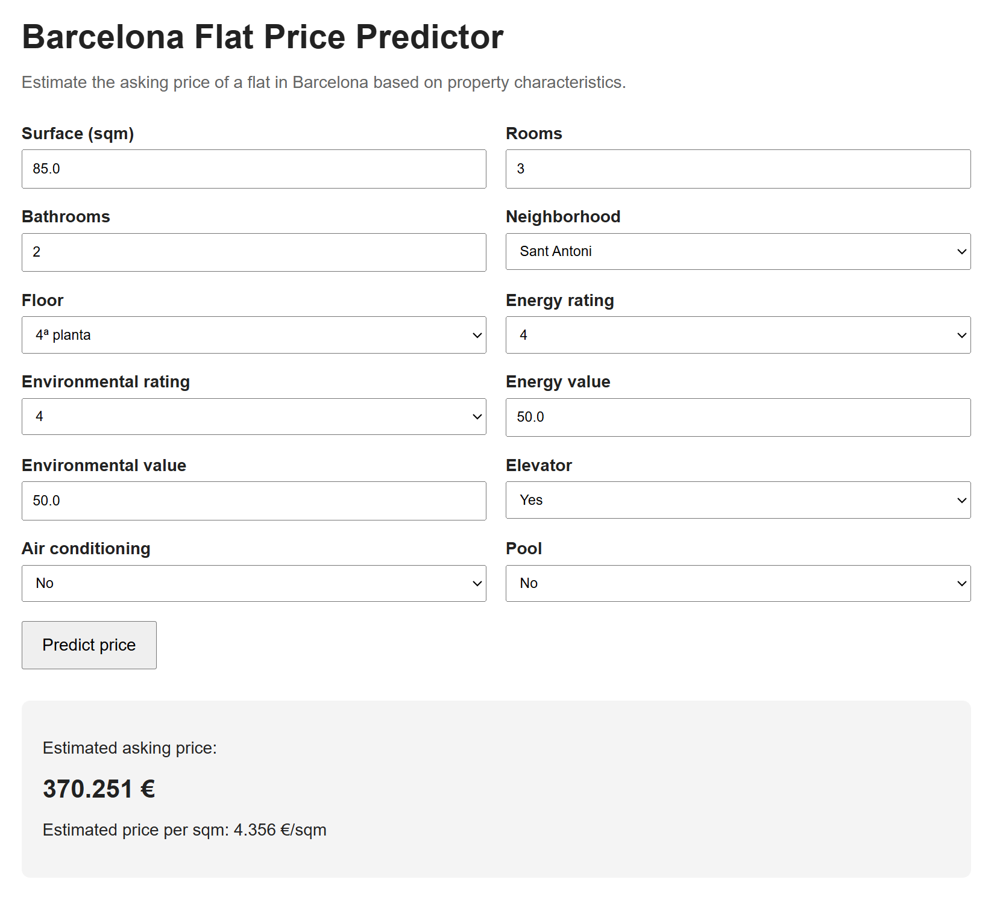

# Barcelona Housing Market Intelligence

This project is an end-to-end data science analysis of Barcelona’s housing listing market.

It combines data acquisition, data preparation, valuation modeling, spatial price analysis, affordability scenario analysis, and a containerized prediction application to understand how listed flat prices vary across the city and how those prices relate to local income levels.

The objective is not only to build a predictive model, but to create a structured analytical workflow that supports market interpretation through reproducible code, clear assumptions, transparent methodology, and a deployable ML application layer.

---

## Project Overview

The project is organized into six components:

1. **Listing Data Collection**
2. **Market Snapshot**
3. **Valuation Model**
4. **Relative Price Positioning**
5. **Affordability Scenarios**
6. **Flat Price Prediction Application**

The data collection, preparation, modeling, and analytical logic is implemented as reusable Python code in `src/`.

The analytical modules are implemented as clean notebooks supported by reusable code. The application layer exposes the trained valuation model through a FastAPI service and a simple web interface, packaged with Docker for reproducible execution.

---

## 1. Listing Data Collection

**Script:** `src/scraping/collect_listings.py`

This component collects raw housing listing data from the underlying search and property-detail endpoints used by the listing platform.

The collection process retrieves listing IDs from paginated search results and then collects detailed information for each listing, including property characteristics, location fields, price information, multimedia counts, energy indicators, and available amenities.

The collected raw files are saved under:

    data/raw/listings/

These files are then consumed by the data preparation pipeline to build the processed dataset used throughout the analysis.

Main outputs:

- Raw listing CSV files
- Listing-level property attributes
- Price and transaction information
- Location and coordinate fields
- Amenity and feature indicators

---

## 2. Market Snapshot

**Notebook:** `notebooks/01_market_snapshot.ipynb`

This module introduces the dataset used throughout the project.

It documents the structure, scope, and quality of the processed listing data. The data preparation pipeline consolidates raw listing files, standardizes fields, filters invalid observations, removes likely duplicates, applies outlier treatment, and creates derived variables such as price per square meter.

Main outputs:

- Processed listing dataset
- Dataset overview
- Key variable distributions
- Missing values summary
- Data scope and limitations

---

## 3. Valuation Model

**Notebook:** `notebooks/02_valuation_model.ipynb`

This module builds a supervised machine learning model to estimate flat asking prices in Barcelona based on property characteristics and location information.

The modeling workflow includes exploratory data analysis, feature engineering, model training, model comparison, hyperparameter optimization, error analysis, and feature importance evaluation.

The final production-ready artifact is exported as a single inference pipeline containing preprocessing, categorical encoding, and the trained model.

Main outputs:

- Baseline model comparison
- Random Forest and XGBoost models
- Optimized valuation model
- Prediction error analysis
- Price-segment evaluation
- Feature importance analysis
- Saved inference pipeline: `models/flat_price_pipeline.joblib`
- Model metadata: `models/model_metadata.json`

Current production pipeline metrics:

- MAE: 77,767.61 €
- RMSE: 110,839.73 €
- R²: 0.8389
- MAPE: 18.43%

---

## 4. Relative Price Positioning

**Notebook:** `notebooks/03_relative_price_positioning.ipynb`

This module analyzes how prices vary across Barcelona districts and neighborhoods.

The analysis compares areas using average asking price, price per square meter, and a Relative Price Pressure Index. This index compares each neighborhood’s average price level against its average property size, providing a structured way to identify areas where prices are proportionally high relative to surface.

Main outputs:

- District-level price summaries
- Neighborhood-level price summaries
- Price per square meter rankings
- Relative Price Pressure Index
- Spatial maps of price indicators

---

## 5. Affordability Scenarios

**Notebook:** `notebooks/04_affordability_scenarios.ipynb`

This module evaluates housing affordability by combining listing prices with local salary estimates.

Each listing is spatially linked to census-section income data. Mortgage burden is then estimated under explicit financing assumptions, including purchase costs, down payment, interest rate, affordability threshold, and single-income versus couple-income scenarios.

Main outputs:

- Listing-level salary estimates
- Minimum affordable mortgage duration
- Fixed 30-year mortgage burden
- District-level affordability summaries
- Neighborhood-level affordability summaries
- Affordability maps

---

## 6. Flat Price Prediction Application

**Application folder:** `application/`

This component exposes the trained valuation model through a lightweight FastAPI application.

The app provides:

- a web form for manual price predictions
- a JSON API endpoint for programmatic predictions
- a health-check endpoint
- Docker support for reproducible local execution

The application loads the production model artifact from:

    models/flat_price_pipeline.joblib

and uses the model metadata from:

    models/model_metadata.json

The app receives raw flat characteristics, applies the saved preprocessing pipeline, and returns an estimated asking price.

Application endpoints:

- `GET /` — web form
- `POST /predict` — form-based prediction
- `POST /api/predict` — JSON API prediction
- `GET /health` — service health check

Example API request:

    {
      "rooms": 3,
      "bathrooms": 2,
      "surface": 85,
      "level8": "Dreta de l'Eixample",
      "floor_desc": "3ª planta",
      "energy_letter": null,
      "environment_letter": null,
      "energy_value": 80,
      "environment_value": 80,
      "elevator": true,
      "air_conditioning": false,
      "pool": false
    }

Example API response:

    {
      "predicted_price": 335820.4,
      "predicted_price_rounded": 335820,
      "predicted_price_per_sqm": 4197.89
    }

Application screenshot:

---

## Repository Structure

    barcelona-housing-market-intelligence/
    │
    ├── application/
    │   ├── README.md
    │   ├── Dockerfile
    │   ├── requirements-app.txt
    │   └── app/
    │       ├── __init__.py
    │       ├── main.py
    │       ├── predictor.py
    │       ├── schemas.py
    │       └── templates/
    │           └── index.html
    │
    ├── data/
    │   ├── raw/
    │   │   └── listings/
    │   ├── processed/
    │   └── external/
    │
    ├── models/
    │   ├── flat_price_pipeline.joblib
    │   └── model_metadata.json
    │
    ├── notebooks/
    │   ├── old/
    │   ├── 01_market_snapshot.ipynb
    │   ├── 02_valuation_model.ipynb
    │   ├── 03_relative_price_positioning.ipynb
    │   └── 04_affordability_scenarios.ipynb
    │
    ├── reports/
    │   ├── figures/
    │   ├── maps/
    │   └── tables/
    │
    ├── src/
    │   ├── paths.py
    │   ├── analysis/
    │   ├── data/
    │   ├── modeling/
    │   └── scraping/
    │
    ├── .dockerignore
    ├── .gitignore
    ├── README.md
    └── requirements.txt

---

## Methodology

The project follows a modular data science workflow:

1. **Data acquisition**  
   Housing listing data is collected from paginated search results and listing-detail endpoints. The raw extracted records are stored as CSV files.

2. **Data preparation**  
   Raw files are consolidated, cleaned, standardized, filtered, and transformed into an analysis-ready dataset.

3. **Valuation modeling**  
   Machine learning models estimate listing asking prices from observable property and location features.

4. **Production inference pipeline**  
   The selected model is exported as a single reusable pipeline containing preprocessing, encoding, and prediction logic.

5. **Spatial price analysis**  
   Districts and neighborhoods are compared using price, price per square meter, and relative price pressure indicators.

6. **Affordability analysis**  
   Listing prices are combined with local salary estimates to evaluate mortgage burden under explicit assumptions.

7. **Application serving**  
   The trained model is exposed through a FastAPI app with both a web interface and a JSON API endpoint.

8. **Containerization**  
   The application is packaged with Docker so that it can run reproducibly across environments.

---

## Key Assumptions and Limitations

This analysis is based on housing listings, not final transaction prices.

Important limitations:

- Listing prices represent asking prices, not final sale prices.
- The dataset reflects visible market supply at the time of data collection.
- Some listings may correspond to reposted or duplicated properties.
- Listing data can vary in completeness and accuracy.
- Salary estimates are linked geographically and should be interpreted as local income proxies.
- Mortgage calculations are scenario-based and do not reproduce exact bank approval processes or full amortization schedules.
- Data collection depends on the availability and stability of the listing platform endpoints.
- The scraping script is intended for reproducible research and should be used responsibly, with delays between requests.
- The prediction app provides estimated asking prices, not certified property valuations.

The results should therefore be interpreted as structured evidence from the listing market, not as definitive estimates of the full housing market.

---

## Technologies Used

- Python
- pandas
- NumPy
- scikit-learn
- XGBoost
- GeoPandas
- Shapely
- Folium
- Matplotlib
- Seaborn
- FastAPI
- Pydantic
- Jinja2
- Uvicorn
- Docker
- requests
- tqdm
- Jupyter Notebook

---

## Model Artifact Versioning

The production model artifact is stored in:

    models/flat_price_pipeline.joblib

The current artifact size is approximately 661 KB, so it is small enough to be committed directly to the repository.

This allows the application to run immediately after cloning the project, without requiring the user to retrain the model first.

The model can still be regenerated using:

    python -m src.modeling.export_model

---

## How to Run

### 1. Install dependencies

    pip install -r requirements.txt

### 2. Collect raw listing data

    python -m src.scraping.collect_listings --start-page 1 --end-page 50

### 3. Generate the processed dataset

    python -m src.data.make_dataset

### 4. Export the production model pipeline

    python -m src.modeling.export_model

### 5. Run the application locally

    pip install -r application/requirements-app.txt
    uvicorn application.app.main:app --reload

Open:

    http://127.0.0.1:8000

API docs:

    http://127.0.0.1:8000/docs

### 6. Run the application with Docker

Build the Docker image:

    docker build -f application/Dockerfile -t bcn-flat-price-app .

Run the container:

    docker run -p 8000:8000 bcn-flat-price-app

Open:

    http://127.0.0.1:8000

---

## Project Commands

Common project commands:

    python -m src.scraping.collect_listings --start-page 1 --end-page 50
    python -m src.data.make_dataset
    python -m src.modeling.export_model
    uvicorn application.app.main:app --reload
    docker build -f application/Dockerfile -t bcn-flat-price-app .
    docker run -p 8000:8000 bcn-flat-price-app

---

## Project Status

The analytical workflow is complete.

The model has been exported as a production-ready inference pipeline and served through a Dockerized FastAPI application.

Future improvements may include automated tests, a model card, continuous integration, and public deployment of the application.
